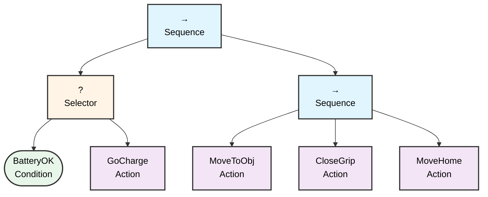

# Battery Reactive Behavior Tree

This document visualizes the battery reactive behavior tree structure.

## Behavior Tree Diagram

## Node Description

### Control Nodes

- **Root Sequence (→)**: Main sequence node that executes children from left to right. Succeeds if all children succeed.
- **Selector (?)**: Fallback node that tries children until one succeeds. Used for battery management.
- **Task Sequence (→)**: Sequence node that executes the main task workflow.

### Condition Nodes

- **BatteryOK**: Checks if the battery level is sufficient to continue operations.

### Action Nodes

- **GoCharge**: Directs the robot to go to the charging station.
- **MoveToObj**: Moves the robot to the target object.
- **CloseGrip**: Closes the gripper to grasp the object.
- **MoveHome**: Returns the robot to the home position.

## Behavior Flow

1. The root sequence starts execution
2. First, the selector checks battery status:
   - If **BatteryOK** succeeds → continue to task sequence
   - If **BatteryOK** fails → execute **GoCharge** action
3. If battery is OK, the task sequence executes:
   - **MoveToObj**: Navigate to target object
   - **CloseGrip**: Grasp the object
   - **MoveHome**: Return to home position

This reactive behavior ensures the robot always maintains sufficient battery before attempting task execution.
