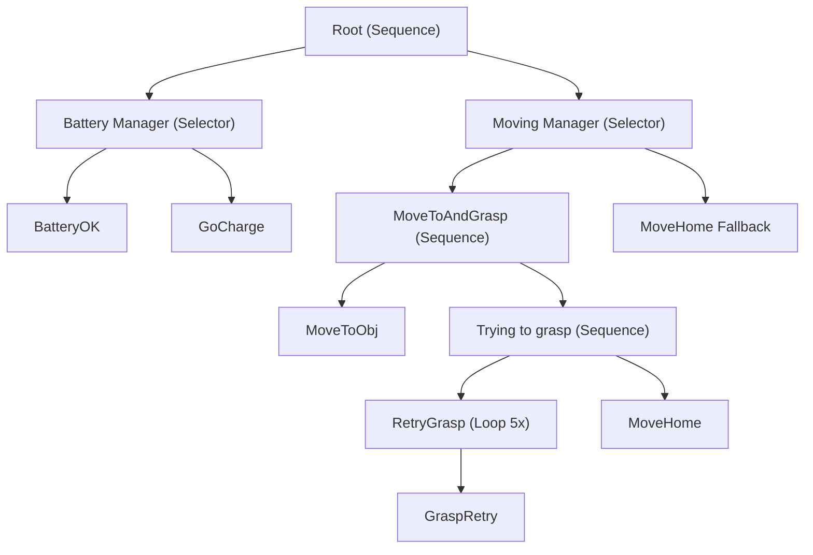

# Reactive robot
## Description 
Implementation of a behaviour tree of a small robot that has to find objects, grasping them and taking them home. 

## Behaviour tree
```text
Root
├── Battery Manager (Selector)
│   ├── BatteryOK
│   └── GoCharge
│
└── Moving Manager (Selector)
    ├── MoveToAndGrasp (Sequence)
    │   ├── MoveToObj
    │   └── Trying to grasp (Sequence)
    │       ├── RetryGrasp (Loop 5)
    │       │   └── GraspRetry
    │       └── MoveHome
    └── MoveHome Fallback
```

## 🌳 Behavior Tree Diagram



## How to use 
In the homework3 directory, run : 
```bash 
python3 reactive_robot_update.py
```

## What are you supposed to observe 
The robot check is the battery is good enough. If so, he will try to go to an object but it can fail (p(failure)=0.1), if it fails the robot go back home and the loop ends. 
If the robot succeeds, he try to grasp the object. This action can also fail (higher probability). In this case, the robot will try 5 times to grasp the object. When the object is grasped (or at the end of the 5 tries), the robot goes back home. 

NB : If you want to observe a specific behaviour, you can modify the probabilities of "finding object" (l.152) and "grasping object" (l.203). 